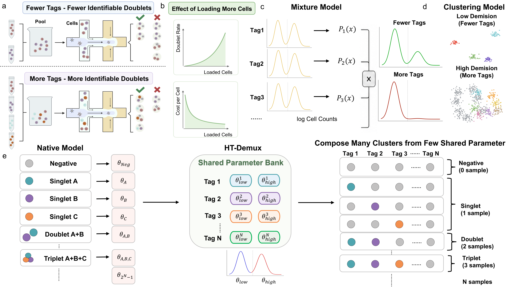

# HT-Demux

HT-Demux is a scalable sample demultiplexing framework for high-throughput hashtag-based single-cell sequencing experiments. It is designed for HTO/CMO-style multiplexed single-cell data, where each droplet or cell barcode contains a vector of sample-tag counts.

HT-Demux models sample-tag signals with shared positive and negative components and performs posterior-based assignment over singlet and multiplet configurations. This design allows the method to assign droplet-level sample identities, identify multiplets, and mark low-confidence droplets as unassigned.

<p align="center">
  
</p>

<p align="center">
  <b>Figure 1.</b> Overview of the HT-Demux framework for scalable sample demultiplexing in high-throughput single-cell sequencing.
</p>

## Overview

Sample multiplexing technologies, such as cell hashing and CMO-based labeling, allow multiple samples to be pooled and sequenced together. Each sample is labeled by a specific tag, and the resulting HTO/CMO count matrix is used to infer the sample origin of each droplet.

However, as the number of multiplexed samples increases, existing demultiplexing methods face two major challenges:

1. The positive component of each sample tag becomes increasingly rare compared with the negative/background component.
2. The number of possible singlet and multiplet configurations grows rapidly with sample number.

HT-Demux addresses these challenges by using a parameter-shared probabilistic formulation. Instead of independently fitting each tag or explicitly estimating every possible multiplet cluster, HT-Demux shares positive and negative tag-level parameters across singlet and multiplet configurations and performs Bayesian posterior inference in the full sample-tag space.

## Features

- Supports 10x-style HTO/CMO count matrices.
- Performs model-based sample demultiplexing.
- Supports singlet, multiplet, and unassigned droplet classification.
- Uses shared sample-tag parameters to improve scalability.
- Provides posterior probabilities for droplet-level assignments.
- Includes utilities for synthetic data generation and evaluation.
- Supports both raw count-like and transformed HTO signal inputs.

## Repository structure

```text
HT-Demux/
├── models/              # Core probabilistic models and optimization routines
├── simulator/           # Synthetic HTO data generation utilities
├── benchmark/           # Scripts for running comparison methods
├── HT_Demux.ipynb       # Example HT-Demux workflow
├── Simulator.ipynb      # Example synthetic data generation workflow
├── Solver.ipynb         # Model fitting and solver exploration
├── classifier.py        # Posterior-to-label assignment utilities
├── evaluator.py         # Evaluation utilities
└── preprocess.py        # Data loading and demultiplexing manager
